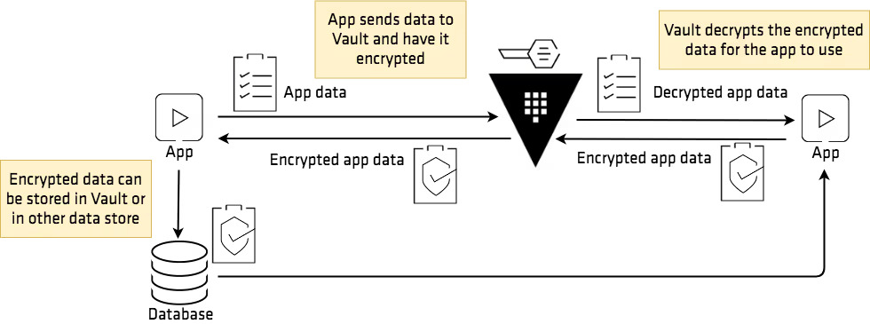

# Vault Transit Client Demo

- A demo project using HashiCorp Vault with Spring Cloud Vault for encrypting and decrypting data using Vault Transit Engine. This project acts as client using Vault's transit secret engine as encryption as a service.

## Use cases

### 1. Store sensitive information


The application leverages Vault's Transit Engine to securely store sensitive information without ever exposing encryption keys to the application or database. The process is as follows:

1. **Plaintext Submission:**
  - The client application collects sensitive data (e.g., credit card number, personal info) from the user.
2. **Encryption Request:**
  - The application sends the plaintext data to Vault's Transit Engine via a secure API call (typically HTTPS).
3. **Vault Encryption:**
  - Vault encrypts the data using a managed key (e.g., `payments` key) and returns the ciphertext to the application.
4. **Store Ciphertext:**
  - The application stores only the ciphertext in the database. The plaintext is never persisted.
5. **Decryption (when needed):**
  - When the original data is needed, the application retrieves the ciphertext from the database and sends it to Vault for decryption. Vault returns the plaintext if the client is authorized.

**Benefits:**
- Encryption keys never leave Vault.    
- Centralized key management and rotation.
- Access control and audit logging via Vault policies.

### 2. Generate data-key to encrypt at rest



For scenarios where you need to encrypt large files or data at rest (e.g., files, blobs), Vault can generate a data key that is used locally for encryption, while the key itself is protected by Vault.

1. **Data Key Generation:**
  - The application requests a new data key from Vault's Transit Engine (e.g., `transit/datakey/plaintext/events`).
  - Vault returns two values:
    - The plaintext data key (used for local encryption)
    - The encrypted (wrapped) data key (to be stored alongside the encrypted data)
2. **Local Encryption:**
  - The application uses the plaintext data key to encrypt the data locally (e.g., using AES-GCM).
  - The encrypted data and the encrypted data key are both stored (e.g., in a database or object storage).
3. **Decryption:**
  - To decrypt, the application retrieves the encrypted data and the encrypted data key.
  - The encrypted data key is sent to Vault for decryption, which returns the plaintext data key.
  - The application uses the plaintext data key to decrypt the data locally.

**Benefits:**
- Only encrypted data keys are stored; plaintext keys are never persisted.
- Enables secure encryption of large data without sending all data to Vault.
- Key rotation and access control are managed by Vault.
---

## Perquisite

- Docker and Docker Compose
- Java 22
- Maven

## Running the Project

### 1. Start Vault and PostgreSQL

```bash
  docker-compose up -d
```

This command will start:
- Vault server on port 8200
- PostgreSQL on port 5432
- Automatically configure Vault with:
  - Transit secrets engine
  - AppRole authentication
  - Encryption keys for payments and events

### 2. Vault Configuration

Vault is automatically configured through the `vault-configure` service in docker-compose with:
- Transit secrets engine enabled
- AppRole authentication enabled
- Encryption keys created:
  - `payments` key
  - `events` key
- Create Vault policy with following content named **payment-application** :

```
path "transit/encrypt/payments" {
  capabilities = ["update"]
}

path "transit/decrypt/payments" {
  capabilities = ["update"]
}

path "transit/decrypt/events" {
  capabilities = ["update"]
}

path "transit/datakey/plaintext/events" {
  capabilities = ["update"]
}
```
- Create role in approle auth method with specify policy:
```shell

  vault write auth/approle/role/payments-app-role \
  token_policies="payment-application" \
  token_ttl="5m" \
  token_max_ttl="10m" \
  token_num_users=0 \
  token_renewable=true

```

- Get approle id:
```shell
  vault read auth/approle/role/payments-app-role/role-id
```

- Get approle secret id:
```shell
  vault write -f auth/approle/role/payments-app-role/secret-id
```

### 3. Application Configuration

The Spring Boot application is configured through `application.properties`:

```properties
spring.cloud.vault.uri=http://127.0.0.1:8200
spring.cloud.vault.authentication=approle
spring.cloud.vault.app-role.role-id=88449979-cdea-36d1-f885-1f5b57ee3511
spring.cloud.vault.app-role.secret-id=add93901-cac9-fde4-1c03-ecef6239ba52
```

### 4. Build and Run the Application

```bash
# Build the application
mvn clean package

# Run the application
java -jar target/vault-transit-0.0.1-SNAPSHOT.jar
```

## Testing

The application runs with the following features:
- Encrypt and decrypt data using Vault Transit Engine
- Store encrypted data in PostgreSQL
- Use AppRole authentication to authenticate with Vault

## Cleanup

To remove all data and start fresh:

```bash
  docker-compose down -v
```

## Notes

- Default Vault token: `vault-root-password`
- PostgreSQL credentials:
  - Username: postgres
  - Password: postgres-admin-password
  - Database: payments 